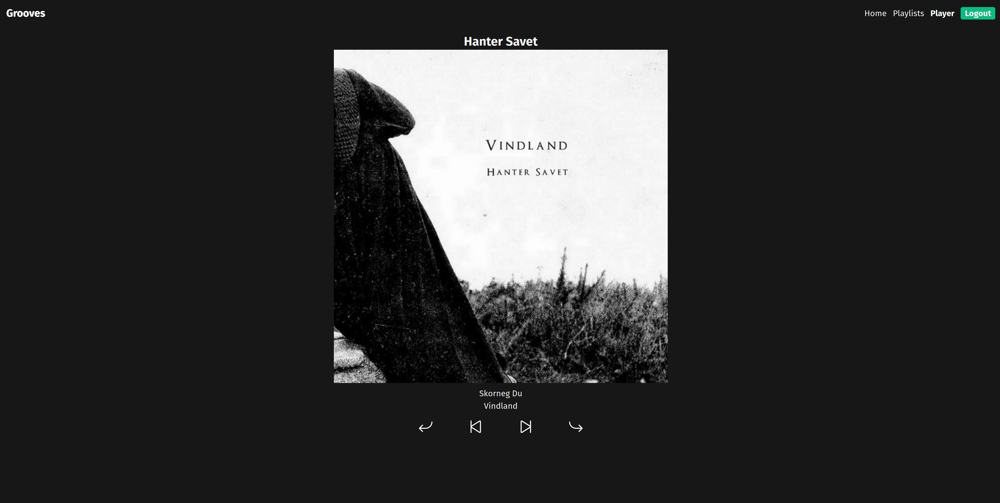

# Grooves

Grooves is a new way to listen to music on Spotify. Create playlists of albums rather than songs and then hit play. Grooves will play through the whole album in order before shuffling to the next album in the playlist. Grooves controls the playback through Spotify, meaning you can listen to music the way you always have, and it will even continue taking care of playback if you close the webpage.

## Playlist Editor

## Player

